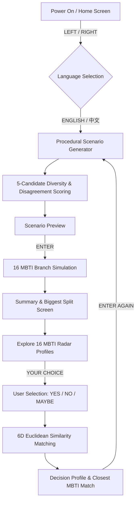
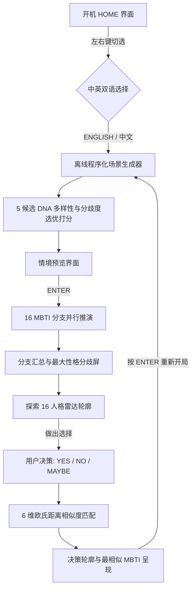

<div align="center">

# 🧠 MBTI Parallel (Pocket MBTI Decision Instrument)

<p align="center">
  <a href="#english">English</a> •
  <a href="#简体中文">简体中文</a>
</p>


An offline, cyberpunk-styled pocket decision simulation instrument for **M5Stack Cardputer**. Predict how 16 MBTI personality types would act under procedural scenarios, generate your 6D decision profile, and explore parallel decision branches in real-time.

[https://github.com/nongxl/MBTI_Parallel.git](https://github.com/nongxl/MBTI_Parallel.git)

---

</div>

<a name="english"></a>
## 🌐 English

### ✨ Key Features

- **⚡ 16 MBTI Parallel Simulation Engine**: Instantly simulates and computes decision outcomes (`YES` / `NO` / `MAYBE`) and rationale for all 16 MBTI personality profiles.
- **🧬 Offline Procedural Scenario Generator**: Pure C++ generation pipeline with 12 Categories × 10 Conflicts × Wording Variants. Zero LLM, zero network required, offering thousands of unique decision scenarios.
- **🎯 Diversity & Disagreement Scoring**: Evaluates candidate scenarios against a 10-DNA history memory buffer to prevent repetitive scenarios while prioritizing scenarios with high MBTI split interest.
- **📊 6D Polar Radar Chart**: Visualizes personality shapes across 6 normalized axes: `NOVELTY`, `RISK`, `PLANNING`, `PRACTICAL`, `LOGIC`, and `SOCIAL`.
- **💫 60FPS Smooth Quintic Ease-Out Morphing**: Features a 400ms high-order Quintic Ease-Out animation curve and dual-layer cyber glow edge rendering when switching personality profiles.
- **🔤 On-Boot Dual Language (i18n)**: Switch between `[ENGLISH]` and `[中文]` directly on the boot home screen.
- **🔄 Unlimited Quick Play Loop**: Press `ENTER` on the match result page to immediately launch the next scenario without returning to the main menu.

---

### 🕹️ System Architecture



---

### 🎮 Controls

| Button | Action |
| :--- | :--- |
| **`LEFT` / `RIGHT`** (`,` / `/` or `A` / `D`) | Switch Language on Boot / 2D Grid Move / Switch MBTI in Explore Mode |
| **`UP` / `DOWN`** (`;` / `.` or `W` / `S`) | Navigate 2D Grid Selection / Move Menu Focus |
| **`ENTER`** | Confirm Selection / Start Simulation / Quick Play Next Scenario |
| **`ESC` / `BACKSPACE`** | Return to Previous Menu or Home Screen |

---

### 🛠️ Hardware Requirements & Memory Footprint

- **Device**: M5Stack Cardputer (ESP32-S3-DevKitC-1-N8)
- **Display**: 240 × 135 Color TFT (M5GFX Double Buffering Canvas)
- **RAM Usage**: `7.6%` (25,044 / 327,680 Bytes)
- **Flash Usage**: `15.4%` (515,701 / 3,342,336 Bytes)

---

### 🚀 Building and Flashing

#### Prerequisites
- [PlatformIO CLI](https://platformio.org/) or PlatformIO extension in VS Code.

#### Clone & Build
```bash
# Clone the repository
git clone https://github.com/nongxl/MBTI_Parallel.git
cd MBTI_Parallel

# Build the firmware
pio run
```

#### Upload to Cardputer
```bash
# Flash to connected M5Cardputer
pio run --target upload
```

---

<br/>

---

<a name="简体中文"></a>
## 🇨🇳 简体中文

### ✨ 核心特性

- **⚡ 16 人格平行决策推演引擎**：瞬间模拟推演 16 种 MBTI 性格模型在特定情境下的决策概率（`同意` / `拒绝` / `犹豫`）及决策依据。
- **🧬 离线程序化场景生成器**：纯 C++ 算法管线，包含 12 大分类 × 10 种决策冲突 × 离线情境文案变体，无需 LLM 和网络，提供数千种不重样的离线决策情境。
- **🎯 多样性与分歧度双重打分**：维护 10 次 DNA 历史记忆，惩罚换皮重复题，同时优先挑选容易产生 MBTI 人格剧烈分歧的高把玩价值场景。
- **📊 6 维极坐标发光雷达图**：直观展示 6 个归一化维度：`NOVELTY` (新奇)、`RISK` (风险)、`PLANNING` (计划)、`PRACTICAL` (实用)、`LOGIC` (逻辑)、`SOCIAL` (社交)。
- **💫 60FPS 五次方缓动形变**：采用 400ms Quintic Ease-Out 高阶减速缓动曲线与双层极客发光连线，切换人格时雷达图拉伸形变如丝般顺滑优雅。
- **🔤 开机双语一键切选 (i18n)**：开机 HOME 屏支持直接使用左右键自由切换 `[ENGLISH]` 与 `[中文]`，全系统深度双语映射。
- **🔄 畅玩无限闭环 (Quick Play Loop)**：在结果页无需退回主菜单，按 `ENTER` 即可无缝生成下一个全新场景，连续畅玩。

---

### 🕹️ 系统架构图



---

### 🎮 按键操作说明

| 按键 | 功能说明 |
| :--- | :--- |
| **`左` / `右`** (`,` / `/` 或 `A` / `D`) | 开机切换中英文 / 2D 网格左右移动 / Explore 模式切换 16 人格 |
| **`上` / `下`** (`;` / `.` 或 `W` / `S`) | 2D 网格上下移动 / 菜单焦点移动 |
| **`ENTER`** | 确认选择 / 开始模拟 / 结果页无缝进入下一个场景 |
| **`ESC` / `BACKSPACE`** | 返回上一级菜单 / 返回开机 HOME 界面 |

---

### 🛠️ 硬件与资源占用

- **硬件设备**：M5Stack Cardputer (ESP32-S3-DevKitC-1-N8)
- **显示屏**：240 × 135 彩色 TFT 屏 (M5GFX 离屏 Sprite 双缓冲区)
- **RAM 占用**：`7.6%` (25,044 / 327,680 字节)
- **Flash 占用**：`15.4%` (515,701 / 3,342,336 字节)

---

### 🚀 编译与烧录指南

#### 前置要求
- [PlatformIO CLI](https://platformio.org/) 或安装有 PlatformIO 插件的 VS Code。

#### 克隆与编译
```bash
# 克隆仓库代码
git clone https://github.com/nongxl/MBTI_Parallel.git
cd MBTI_Parallel

# 编译固件
pio run
```

#### 烧录至 Cardputer 实体设备
```bash
# 将固件烧录至已连接的 Cardputer
pio run --target upload
```

---

### 📄 开源协议

本项目采用 [MIT License](LICENSE) 开源协议。
